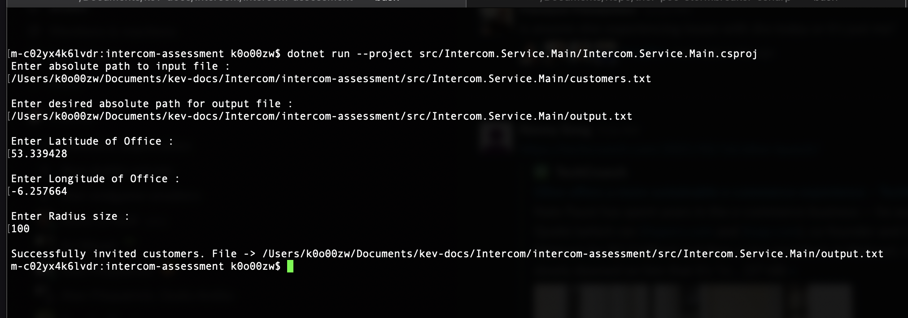
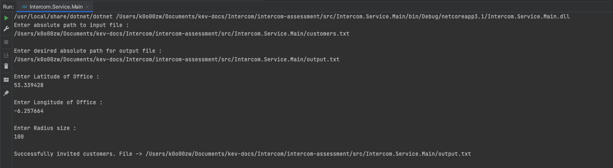
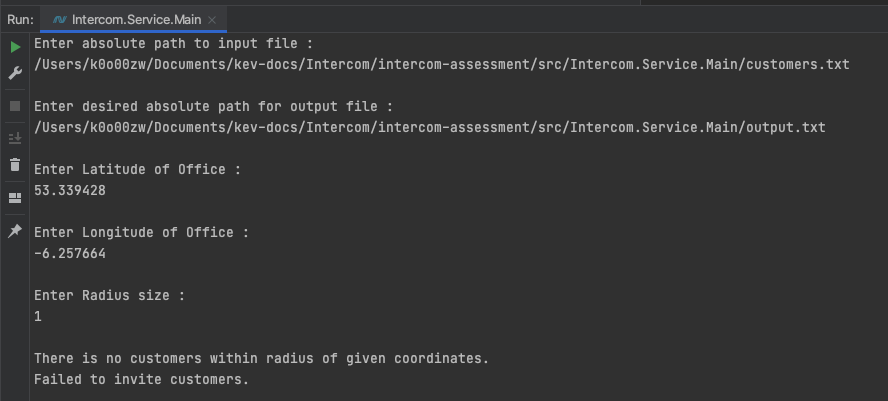

# intercom-assessment
This is my submission for the intercom take home assessment. Please see steps below on how to run locally and run tests. I have included my output in the root of this repo in a file called ``output.txt``.
The submission for the second part of the assessment is in the file ``ProudestAchievement.md``. 

## Info 
This project is written in C#, with Unit Tests and Integration tests also written in C#, using Xunit and Moq. 

## Installing Project

- Clone repo to local machine -> ``git clone https://github.com/oneilk38/intercom-assessment.git``
- Ensure you have .NET installed on your machine. I am running ``.NET version 5.0.101``
- When in the root directory of repo, run the following command to restore packages -> ``dotnet restore``
- When in the root directory of repo, run the following command to build solution -> ``dotnet build``

## Running Project Through Command Line
- When in root directory of repo, run the following command to start project -> ``dotnet run --project src/Intercom.Service.Main/Intercom.Service.Main.csproj``
- You will be prompted to enter the absolute file path for the input file of customers. I have included it in the Intercom.Service.Main directory, so for me the absolute path is -> ``/Users/k0o00zw/Documents/intercom-assessment/src/Intercom.Service.Main/customers.txt
  ``. Please point to any input file you you wish if it is stored in a different location.
- You will then be prompted to enter the desired absolute path for your output file -> ``/Users/k0o00zw/Documents/intercom-assessment/src/Intercom.Service.Main/output.txt``. Note, if a file already exists at that location, it will ask you to pick a new filename.
- You will then be prompted to enter the Latitude of the Office -> ``53.339428``
- You will then be prompted to enter the Longitude of the Office -> ``-6.257664``
- Finally you will be asked to input the radius size -> ``100``
- If successful you will see the following output ->
  
- If for some reason there was no output written you will see -> ``There is no customers within radius of given coordinates. Failed to invite customers.``

## Running Through Rider/Visual Studio 
- the steps are essentially same as above. Click on the Intercom.Service.Main project and click "run".
- A command line will appear in your IDE and input is same as above. 
- If successful you will see the following output ->
  
- If not successful you will see ->
  
  

## Running Tests via Command Line 
- To run unit tests, when in the root directory of repo, run the following command to build solution -> ``dotnet test src/Intercom.Tests.UnitTests/Intercom.Tests.UnitTests.csproj``
- To run integration tests, when in the root directory of repo, run the following command to build solution -> ``dotnet test src/Intercom.Tests.IntegrationTests/Intercom.Tests.IntegrationTests.csproj``

--- 

## Approach/Design 
I wanted to split the functionality of the code into segments, making the code more modular and easy to test. I use interfaces to abstract some of the logic away from operations, also allowing me to better unit test, as I can create mocked classes and test accordingly. 

I also split the project up into 4 sections :

**Project** | **Description**
----------------|----------------
``Intercom.Library.CustomerInviter`` | This project is where the logic for determining what customers to invite and the output of that lives. I placed this in a standalone project so that the different component could be reused if we need to. If we need to expose this logic to an API or a new service, they can reuse all the different components of this solution as they need. 
``Intercom.Service.Main`` | This is the actual project which will run and output customers to an output file. The only logic in this service is how it gets input from the user, all this service does then is calls functions in the CustomerInviter library mentioned above. 
``Intercom.Tests.UnitTests`` | This test project is solely used for unit tests. Any class / function that has a dependency is mocked out, so we can just test that function / class in isolation. 
``Intercom.Tests.IntegrationTests`` | This tests project tests all the various components together as a whole (expect IO as I dont want to output new files as a result of a test). 

### Classes 
**Class** | **Description**
----------------|----------------
``Customer`` | This class is used to deserialise the text in the input file. This class contains properties such as the latitude, longitude, name and id of customer. It is worth noting that the latitude and longitude passed in to the program are strings, so we must first deserialise them to strings, and then we have a separate function which parsed these strings to doubles to get the actual coordinates. If there is a failure when parsing, this customer will not be added to the list of inputted customers as it is invalid data. 
``DistanceCalculator`` | This class is used to calculate the distance between two sets of coordinates. The function which returns distance is static, so we dont have initialise a new instance of this class ever.
``Inviter`` |  This class is responsible for inviting the customers. It determines which customers are within the radius and passes that to our IOHandler to write to output file. 
``IOHandler`` |  This class reads the customer input from file and writes to output file. 
``Radius`` | This class is used to determine whether or not a customer is within a given radius. 

## Interfaces 
**Interface** | **Description**
----------------|----------------
``IO`` | This interface allows us to abstract the logic for reading from and writing to Files.
``IRadius`` |  This interface allows us to abstract the logic of determining whether a user is within the radius of given coordinates.

